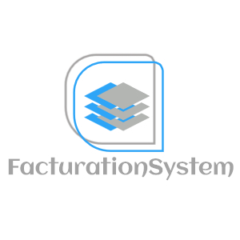

<div id="top"></div>
<!--
*** Thanks for checking out the Best-README-Template. If you have a suggestion
*** that would make this better, please fork the repo and create a pull request
*** or simply open an issue with the tag "enhancement".
*** Don't forget to give the project a star!
*** Thanks again! Now go create something AMAZING! :D
-->


<!-- PROJECT SHIELDS -->
<!--
*** I'm using markdown "reference style" links for readability.
*** Reference links are enclosed in brackets [ ] instead of parentheses ( ).
*** See the bottom of this document for the declaration of the reference variables
*** for contributors-url, forks-url, etc. This is an optional, concise syntax you may use.
*** https://www.markdownguide.org/basic-syntax/#reference-style-links
-->


<!-- PROJECT LOGO -->
<br />
<div align="center">
  <a href="https://github.com/RolEYder/FacturationSystem">
    
  </a>

  <h3 align="center">FacturationSystem</h3>

  <p align="center">
  A Highly Customizable Invoicing System Written in C#
    <br />
    <a href="https://github.com/RolEYder/FacturationSystem/wiki"><strong>Explore the docs »</strong></a>
    <br />
    <br />
    <a href="https://github.com/RolEYder/FacturationSystem/wiki">View Demo</a>
    ·
    <a href="https://github.com/RolEYder/FacturationSystem/issues">Report Bug</a>
    ·
    <a href="https://github.com/RolEYder/FacturationSystem/issues">Request Feature</a>
  </p>
</div>


<!-- TABLE OF CONTENTS -->
<details>
  <summary>Table of Contents</summary>
  <ol>
    <li>
      <a href="#about-the-project"> About The Project</a>
      <ul>
        <li><a href="#built-with"> 🔧 Built With</a></li>
         <li><a href="#folder-structure"> 📂 Folder Structure</a></li>
      </ul>
    </li>
    <li>
      <a href="#getting-started"> 🏃‍♂️ Getting Started</a>
      <ul>
        <li><a href="#prerequisites">Prerequisites</a></li>
        <li><a href="#installation">Installation</a></li>
      </ul>
    </li>
    <li><a href="#usage">Usage</a></li>
    <li><a href="#contributing">Contributing</a></li>
    <li><a href="#license">License</a></li>
    <li><a href="#contact">Contact</a></li>
    <li><a href="#acknowledgments">Acknowledgments</a></li>
  </ol>
</details>


<!-- ABOUT THE PROJECT -->
## About The Project

  <a href="images/screenshot.png">
    
  </a>

Invoicing system allows you to manage your warehouses and manage different types of invoices for the sale of your products quickly and safely. This invoicing system offers high scalability due was built using a layered architecture. 


<p align="right">(<a href="#top">back to top</a>)</p>


### 🔧 Built With 

This project was build with: 

* [Visual Studio Community](https://visualstudio.microsoft.com/vs/community/)
* [SQL Management Studio](https://docs.microsoft.com/en-us/sql/ssms/download-sql-server-management-studio-ssms?view=sql-server-ver15)
* [Report Viewer](https://docs.microsoft.com/en-us/sql/reporting-services/application-integration/integrating-reporting-services-using-reportviewer-controls-get-started?view=sql-server-ver15)
* [.NET Framework 4.7](https://dotnet.microsoft.com/en-us/download/dotnet-framework/net47)
* [Travis CI](https://www.travis-ci.com/)

<p align="right">(<a href="#top">back to top</a>)</p>

### 📂 Folder Structure
```
  ├── CapaAccesoDatos                  # Helps the Business Layer to connect to the data
  ├── CapaNegocio                      # Validations or calculations to the data.
  ├── CapaPresentacion                 # Windows Forms where data is presented to the user
  ├── images                           # Images folder
  ├── packages                         # Tools and utilities installed from NuGet
  ├── sistemaROLEY.sln                 # Project solution
  └── README.md                        # README
```

<!-- GETTING STARTED -->
## 🏃‍♂️ Getting Started

This is an example of how you may give instructions on setting up your project locally.
To get a local copy up and running follow these simple example steps.

### Prerequisites

To run the project successfully, you must have already installed the mentioned tools at <a href="#built-with"> Built With</a>.


### Installation

Below is an example of how to install and set up the project successfully. 


1. Make sure that you have installed all the tools mentioned above. 
2. Clone the repo
   ```bash
    git clone https://github.com/RolEYder/FacturationSystem.git
   ```
3. Set the database
4. Set your connection string. Open `Conexion.cs` at CapaAccesoDatos folder and replace it with your own connection string.
  ```csharp 
        public SqlConnection sqlConnectionCursor()
        {
            try
            {
                SqlConnection cn = new SqlConnection();
                cn.ConnectionString = "YOU-CONNECTION-STRING";
                return cn;
            }
            catch (Exception)
            {
                throw;
            }
        }
  ```


<p align="right">(<a href="#top">back to top</a>)</p>


<!--   EXAMPLES -->
## Usage
This section shows useful examples of how the project can be used. You can see additional screenshots, code examples, and demos. 

_For more examples, please refer to the [Wiki](https://github.com/RolEYder/FacturationSystem/wiki) to see the usage functionalities_.

<p align="right">(<a href="#top">back to top</a>)</p>


<!-- CONTRIBUTING -->
## Contributing


This is a project that does not permit folks, it’s just for personal use. But you should run it and report any issue that you should find at the [issues](https://github.com/RolEYder/FacturationSystem/issues) section. 

If you have a suggestion that would make this better, you can also simply open an issue with the tag “enhancement”. Don’t forget to give the project a start 🌟 ! Thank you 🙏!

<p align="right">(<a href="#top">back to top</a>)</p>


<!-- LICENSE -->
## License

Distributed under the MIT License. See `LICENSE.txt` for more information.

<p align="right">(<a href="#top">back to top</a>)</p>


<!-- CONTACT -->
## Contact

rolEYder
```sh
    echo moc.liamg@zaidaicragreggor | sed -r 'G;:a;s/^(.)(.*\n)/\2\1/;ta;s/\n//' 
```

Project Link: [https://github.com/RolEYder/FacturationSystem](https://github.com/RolEYder/FacturationSystem)

<p align="right">(<a href="#top">back to top</a>)</p>


<!-- ACKNOWLEDGMENTS -->
## Acknowledgments

List of resources used in this project and would like to give credit to. 

* [Report Viewer Documentation](https://docs.microsoft.com/en-us/sql/reporting-services/application-integration/integrating-reporting-services-using-reportviewer-controls-get-started?view=sql-server-ver15)
* [XML For SQL](https://docs.microsoft.com/en-us/sql/relational-databases/xml/for-xml-sql-server?view=sql-server-ver15)
* [Travis CI](https://www.travis-ci.com/)


<p align="right">(<a href="#top">back to top</a>)</p>


<!-- MARKDOWN LINKS & IMAGES -->
<!-- https://www.markdownguide.org/basic-syntax/#reference-style-links -->
[contributors-shield]: https://img.shields.io/github/contributors/othneildrew/Best-README-Template.svg?style=for-the-badge
[contributors-url]: https://github.com/RolEYder/FacturationSystem/graphs/contributors
[forks-shield]: https://img.shields.io/github/forks/othneildrew/Best-README-Template.svg?style=for-the-badge
[forks-url]: https://github.com/RolEYder/FacturationSystem/network/members
[stars-shield]: https://img.shields.io/github/stars/othneildrew/Best-README-Template.svg?style=for-the-badge
[stars-url]: https://github.com/RolEYder/FacturationSystem/stargazers
[issues-shield]: https://img.shields.io/github/issues/othneildrew/Best-README-Template.svg?style=for-the-badge
[issues-url]: https://github.com/RolEYder/FacturationSystem/issues
[license-shield]: https://img.shields.io/github/license/othneildrew/Best-README-Template.svg?style=for-the-badge
[license-url]: https://github.com/RolEYder/FacturationSystem/blob/master/LICENSE.txt
[linkedin-shield]: https://img.shields.io/badge/-LinkedIn-black.svg?style=for-the-badge&logo=linkedin&colorB=555
[linkedin-url]: https://linkedin.com/in/othneildrew
[product-screenshot]: [images/screenshot.png](https://example.com/)
